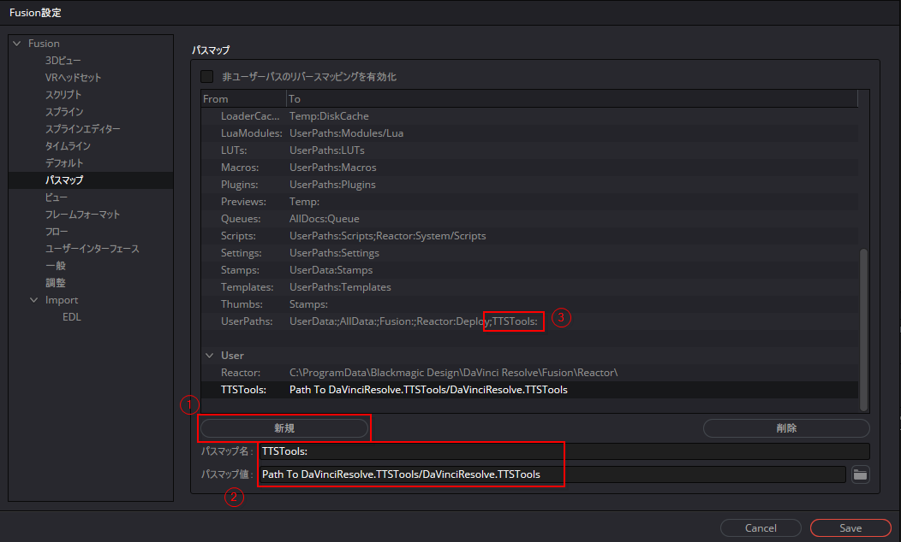

# DaVinci Resolve TTS Tools

A set of tools for making videos using TTS that come with characters in DaVinci Resolve. Ready for VOICEROID / A.I.VOICE / VOICEVOX.

## Features

Currently this project is under development.

- [x] Import voices to a single track
- [x] Import subtitles to multiple tracks by speaker
- [ ] Generate Fusion Composition from PSD files (WIP)

## Requirements

Windows Only.

## Installation

Even if DaVinci Resolve is running during installation, the change will be reflected without problems.

### Option 1: Using Pathmap

1. Open DaVinci Resolve.
2. Go to `Fusion` tab, Go to menu bar and click `Fusion/Fusion Settings...`
3. Create `Path Map Name`: `TTSTools:` `Path Map Value`: (Path to `DaVinciResolve.TTSTools/DaVinciResolve.TTSTools`)
4. Add `;TTSTools:` to  `UserPaths:`

### Option 2: Direct Installation

1. Run apply.sh. (Installation of [git bash](https://gitforwindows.org/) required.)

After installation, scripts will be added to `Workspace/Scripts/Comp` in the menu bar.

## Alternatives

- [NUROKU/DavinciResolve\_VoiceAutoTool](https://github.com/NUROKU/DavinciResolve_VoiceAutoTool) - MIT
- [nakano000/Resolve\_Script](https://github.com/nakano000/Resolve_Script) - MIT

## For Developers

See [wiki](https://github.com/34j/DaVinciResolve.TTSTools/wiki) for further information.
